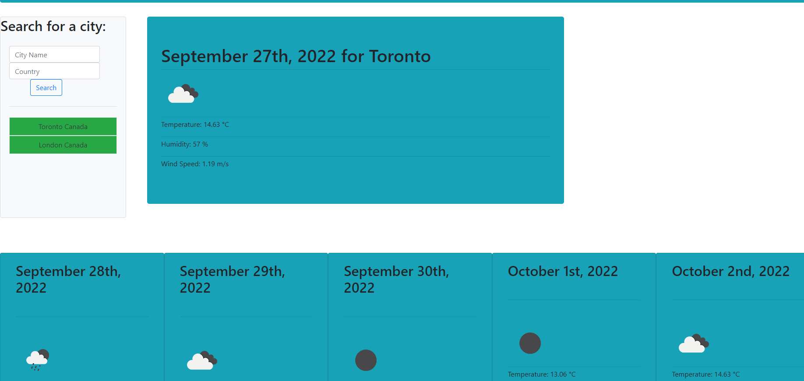

# <Weather-Dashboard>

## Description

An exercise in accessing server APIs, this repo is built from scratch in order to have user input in order to run a fetch request for weather data through openweathermap's API
Allowing users to search different cities in different counties in order to then display weather data so that one can play their future days in regards to the weather.

## Installation

No installation required, simply go to the linked page down below, or download the repo and run from the index.html

## Usage

To use the repo, simply enter a city and country combination into the side input bars, then press the 'Search' button in order to fetch the weather data for that city.
Alternatively, once history of searches has been inputted, clicking on the areas will input that information into the system to run the fetch function instead.

Link: https://nathankryz.github.io/Weather-Dashboard/

Screenshot:

## Credits

Made with the help of Moment JS, Bootstrap, and Jquery, using API from Openweathermap

Moment JS: https://momentjs.com/

Bootstrap: https://getbootstrap.com/

JQuery: https://jquery.com/

Openweathermap: https://openweathermap.org/
